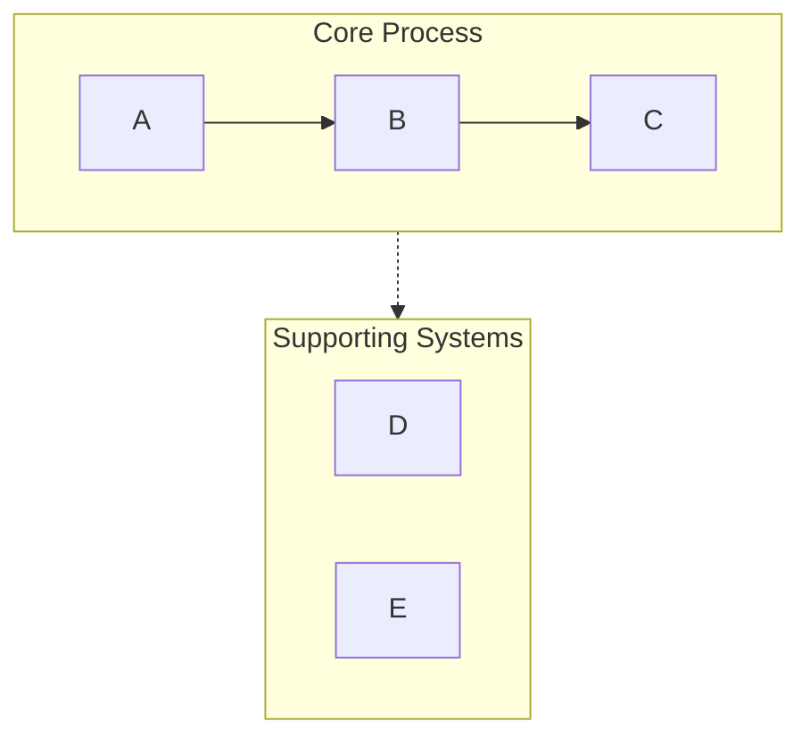
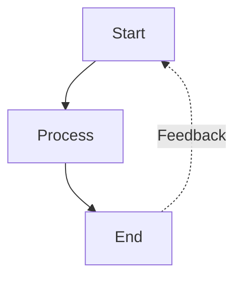
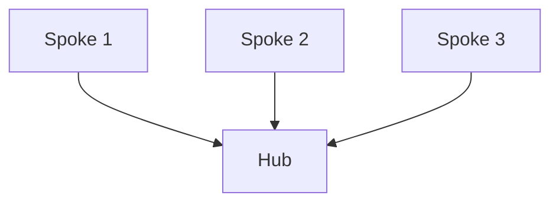
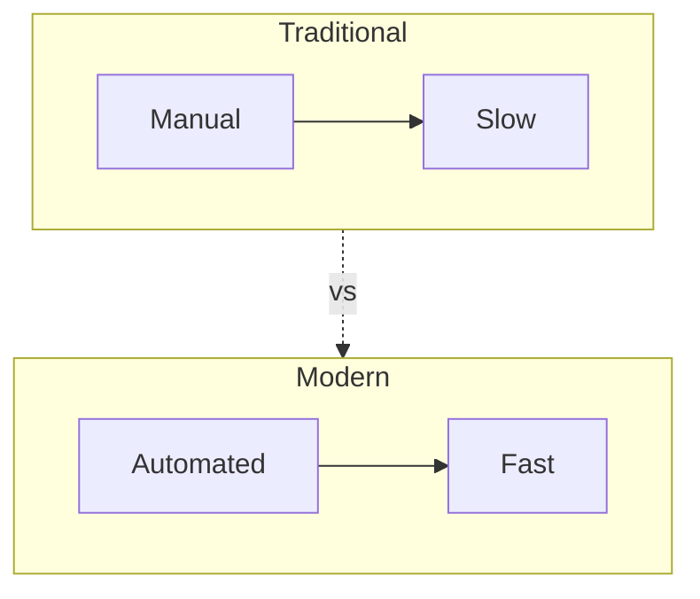

# Generating Mermaid Diagrams

Convert text content into clean, professional Mermaid diagrams with validation, optimization, and HTML export. Automatically handles common syntax pitfalls (list syntax conflicts, subgraph naming, spacing issues) to ensure diagrams render correctly.

## Quick Start

```bash
# Basic flowchart
npx -y bun skills/generating-mermaid-diagrams/scripts/main.js "用户注册 -> 验证邮箱 -> 完成" -o flowchart.html

# Sequence diagram
npx -y bun skills/generating-mermaid-diagrams/scripts/main.js "API调用流程" -t sequence -r 16:9 -c green -o api.html

# From template
npx -y bun skills/generating-mermaid-diagrams/scripts/main.js --template gantt-project -o project.html

# Generate samples
npx -y bun skills/generating-mermaid-diagrams/scripts/main.js --sample

# Validate only
npx -y bun skills/generating-mermaid-diagrams/scripts/main.js --validate-only "graph LR A --> B"
```

## Options

| Option | Description |
|--------|-------------|
| `-t, --type` | Diagram: flowchart, sequence, class, state, er, gantt, pie, mindmap |
| `-r, --ratio` | Ratio: 4:3, 3:4, 16:9, 1:1, 3:2, 2:3 |
| `-c, --scheme` | Color: blue, green, purple, orange |
| `-d, --direction` | Direction: TB, BT, LR, RL |
| `-i, --input` | Input file |
| `-o, --output` | Output file |
| `-s, --sample` | Generate sample diagrams |
| `--template` | Use built-in template |
| `--validate-only` | Validate syntax only |

## Diagram Types

| Type | Best Ratio | Best For |
|------|------------|----------|
| flowchart | 4:3 | Process flows, workflows, decision trees |
| sequence | 16:9 | API calls, message flows, interactions |
| class | 4:3 | Architecture, OOP design |
| state | 4:3 | State machines, lifecycle stages |
| gantt | 16:9 | Project timelines |
| pie | 1:1 | Data distributions |
| mindmap | 3:4 | Hierarchies, brainstorming |

## Workflow

1. **Analyze content** - Identify key concepts, relationships, and flow
2. **Choose diagram type** - Select the most appropriate visualization
3. **Select configuration** - Determine layout, detail level, and styling
4. **Generate diagram** - Create syntactically correct Mermaid code
5. **Validate & export** - Run validation and output HTML

**Default assumptions:**
- Vertical layout (TB) unless horizontal requested
- Medium detail level (balanced between simplicity and information)
- Professional color scheme with semantic colors

## Critical Syntax Rules

**Always follow these rules to prevent parsing errors:**

### Rule 1: Avoid List Syntax Conflicts
```
❌ WRONG: [1. Perception]       → Triggers "Unsupported markdown: list"
✅ RIGHT: [1.Perception]         → Remove space after period
✅ RIGHT: [① Perception]         → Use circled numbers (①②③④⑤⑥⑦⑧⑨⑩)
✅ RIGHT: [(1) Perception]       → Use parentheses
✅ RIGHT: [Step 1: Perception]   → Use "Step" prefix
```

### Rule 2: Subgraph Naming
```
❌ WRONG: subgraph AI Agent Core  → Space in name without quotes
✅ RIGHT: subgraph agent["AI Agent Core"]  → Use ID with display name
✅ RIGHT: subgraph agent          → Use simple ID only
```

### Rule 3: Node References
```
❌ WRONG: Title --> AI Agent Core  → Reference display name directly
✅ RIGHT: Title --> agent          → Reference subgraph ID
```

### Rule 4: Special Characters in Node Text
```
✅ Use quotes for text with spaces: ["Text with spaces"]
✅ Escape or avoid: quotation marks → use 『』instead
✅ Escape or avoid: parentheses → use 「」instead
✅ Line breaks in circle nodes only: ((Text<br/>Break))
```

### Rule 5: Arrow Types
- `-->` solid arrow (default)
- `-.->` dashed arrow (for supporting systems, optional paths)
- `==>` thick arrow (for emphasis)
- `~~~` invisible link (for layout only)

## Color Scheme Semantics

Standard professional palette with semantic meaning:

| Color | Hex | Use Case |
|-------|-----|----------|
| Green | #d3f9d8/#2f9e44 | Input, perception, start states |
| Red | #ffe3e3/#c92a2a | Planning, decision points |
| Purple | #e5dbff/#5f3dc4 | Processing, reasoning |
| Orange | #ffe8cc/#d9480f | Actions, tool usage |
| Cyan | #c5f6fa/#0c8599 | Output, execution, results |
| Yellow | #fff4e6/#e67700 | Storage, memory, data |
| Pink | #f3d9fa/#862e9c | Learning, optimization |
| Blue | #e7f5ff/#1971c2 | Metadata, definitions, titles |
| Gray | #f8f9fa/#868e96 | Neutral elements, traditional systems |

## Common Patterns

### Swimlane Pattern (Grouping)


### Feedback Loop Pattern


### Hub and Spoke Pattern


### Comparison Pattern


## Quality Checklist

Before outputting, verify:
- [ ] No "number. space" patterns in any node text
- [ ] All subgraphs use proper ID["display name"] syntax
- [ ] All arrows use correct syntax (-->, -.->)
- [ ] Colors applied consistently with semantic meaning
- [ ] Layout direction specified (TB/LR)
- [ ] Style declarations present
- [ ] No ambiguous node references
- [ ] Validated with `--validate-only` flag

## Example Usage Patterns

**Pattern 1: Basic request**
```
User: "Visualize the software development lifecycle"
→ npx -y bun skills/generating-mermaid-diagrams/scripts/main.js "需求分析 -> 设计 -> 开发 -> 测试 -> 部署" -o sdlc.html
```

**Pattern 2: With configuration**
```
User: "Create a horizontal flowchart of our sales process"
→ npx -y bun skills/generating-mermaid-diagrams/scripts/main.js "销售流程" -t flowchart -d LR -r 16:9 -o sales.html
```

**Pattern 3: Comparison**
```
User: "Compare traditional AI vs AI agents"
→ npx -y bun skills/generating-mermaid-diagrams/scripts/main.js "传统AI vs AI代理" -t flowchart -o comparison.html
```

## Layout Guide

**4-Step Process**: Count blocks → Set ratio → Choose direction → Balance nodes

| Subgraphs | Ratio | Min Width |
|-----------|-------|-----------|
| 2-6 | 4:3 | 800px |
| 7-12 | 16:9 | 950px |

## References

- [Syntax Rules](references/syntax-rules.md) - Complete validation rules and error prevention
- [Layout Guide](references/layout.md) - Optimization, anti-patterns, aspect ratios
- [Templates](references/templates.md) - Built-in templates, colors, diagram types

## Script Directory

**Important**: All scripts are located in the `scripts/` subdirectory of this skill.

**Agent Execution Instructions**:
1. Determine this SKILL.md file's directory path as `SKILL_DIR`
2. Script path = `${SKILL_DIR}/scripts/<script-name>.js`
3. Replace all `${SKILL_DIR}` in this document with the actual path

**Script Reference**:
| Script | Purpose |
|--------|---------|
| `scripts/main.js` | Main entry point, CLI tool for generating diagrams |
| `scripts/templates.js` | Diagram template generators |
| `scripts/validator.js` | Mermaid syntax validation |
| `scripts/optimizer.js` | Layout optimization and HTML export |

## Extension Support

Custom styles and configurations via EXTEND.md.

**Check paths** (priority order):
1. `.life-good-skill/generating-mermaid-diagrams/EXTEND.md` (project)
2. `~/.life-good-skill/generating-mermaid-diagrams/EXTEND.md` (user)

If found, load before Step 1. Extension content overrides defaults.

---

## Prompt Content

When loaded, AI acts as:

**Role**: Mermaid Diagram Expert

**Context**:
- User wants to visualize concepts, processes, or relationships
- Goal: Generate syntactically correct, visually appealing Mermaid diagrams
- Output: Valid Mermaid code with HTML preview

**Task**:
1. Analyze input text to identify concepts and relationships
2. Select optimal diagram type (flowchart, sequence, class, state, er, gantt, pie, mindmap)
3. Apply syntax rules:
   - Remove spaces after numbered list items
   - Use proper subgraph ID["display name"] syntax
   - Quote text with special characters
4. Choose appropriate direction (TB/LR/RL/BT)
5. Apply semantic color scheme

**Output**:
- Mermaid diagram code block
- HTML file with live preview (when -o specified)
- Validation report

**Process**:
1. Parse input text for key concepts
2. Map relationships between concepts
3. Generate Mermaid syntax with proper escaping
4. Apply professional color scheme
5. Export to HTML with CDN-based rendering

**Opening**: "请描述您想可视化的内容，我将生成专业的 Mermaid 图表。"

**Script Usage**:
```bash
npx -y bun ${SKILL_DIR}/scripts/main.js "流程描述" -t flowchart -o diagram.html
npx -y bun ${SKILL_DIR}/scripts/main.js --sample
```
