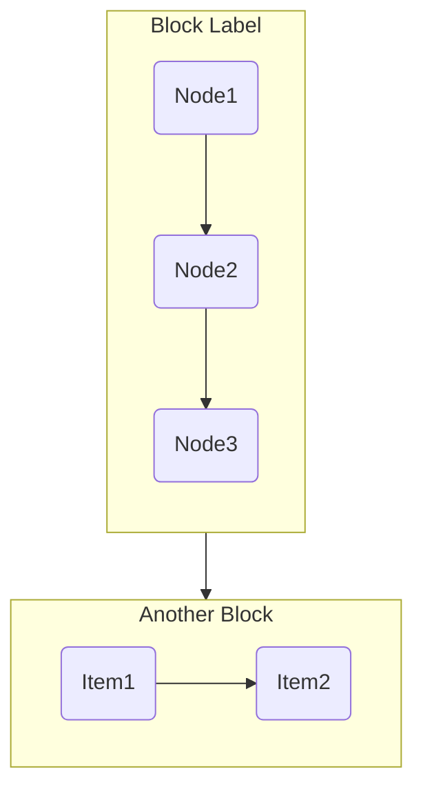

# Layout Optimization Guide

Layout optimization ensures Mermaid diagrams have proper proportions and visual balance.

## 4-Step Process

### Step 1: Determine Subgraph Count

Count logical blocks. Each block represents a distinct concept or phase.

```javascript
const blocks = [
  { name: 'core', label: '核心问题', nodes: [...] },
  { name: 'iden', label: '身份解剖', nodes: [...] },
  { name: 'stage', label: '自我发展', nodes: [...] },
  { name: 'cyb', label: '控制论', nodes: [...] },
];
```

### Step 2: Calculate Optimal Aspect Ratio

| Subgraphs | Ratio | Grid | Min Width |
|-----------|-------|------|-----------|
| 2-4 | 4:3 | 2x2 | 800px |
| 5-6 | 4:3 | 2x3 | 800px |
| 7-8 | 16:9 | 2x4 | 950px |
| 9-12 | 16:9 | 3x4 | 950px |
| 12+ | 16:9 | larger | 1000px |

### Step 3: Choose Flow Direction

| Content | Direction | Reason |
|---------|-----------|--------|
| 6+ subgraphs, 20+ nodes | TB | Vertical flow for complex |
| 4-6 subgraphs, 15-20 nodes | TB | Default |
| 4-6 subgraphs, <15 nodes | LR | Horizontal for simple |

### Step 4: Balance Subgraphs

Max 6 nodes per subgraph. Split if needed.

## Standard Ratios

| Ratio | Width | Height | Best For |
|-------|-------|--------|----------|
| 4:3 | 800 | 600 | Flowcharts |
| 16:9 | 960 | 540 | Sequences, wide |
| 1:1 | 600 | 600 | Pie, mindmaps |
| 3:4 | 600 | 800 | Tall hierarchies |
| 3:2 | 750 | 500 | Gantt |

## Parameters

| Parameter | Default | When to Change |
|-----------|---------|----------------|
| rankSpacing | 30-45 | TB: 45, LR: 35 |
| nodeSpacing | 20-35 | TB: 35, LR: 25 |
| minWidth | 800-950 | 7+ subgraphs: 950px |

---

## Anti-Patterns & Fixes

### Problem 1: classDef Not Working

**Symptom**: Styles don't apply.

**Cause**: `classDef` needs `%%` prefix.

```mermaid
%% WRONG
classDef core fill:#e94560
class A core

%% CORRECT
%%{init: {'themeVariables': {}}}%%
classDef core fill:#e94560,stroke:#333
class A,B,C core
```

### Problem 2: Diagram Too Small

**Symptom**: Complex diagram appears tiny.

**Fix**:
```css
.mermaid-container {
    min-width: 950px;
    overflow-x: auto;
}
```

```javascript
mermaid.initialize({
    flowchart: {
        rankSpacing: 45,
        nodeSpacing: 35,
    }
});
```

### Problem 3: Wrong Aspect Ratio

**Symptom**: Diagram stretched or cramped.

**Fix**: Use 16:9 for 7+ subgraphs.

### Problem 4: Nested Subgraph Issues

**Symptom**: Layout breaks, overlapping nodes.

**Cause**: 3+ levels of nesting.

```mermaid
%% WRONG - 3 levels
subgraph A
    subgraph B
        subgraph C
            N1 --> N2
        end
    end
end

%% CORRECT - max 2 levels
subgraph A
    direction LR
    N1 --> N2 --> N3
end
```

### Problem 5: Mindmap Styling Not Working

**Symptom**: `:: style` syntax doesn't work.

**Fix**: Use simple labels only.

```mermaid
%% WRONG
mindmap
  root((中心))
    节点1 :: pink

%% CORRECT
mindmap
  root((中心))
    节点1[红色节点]
```

## Subgraph Syntax



## Best Practices

### DO
- Keep 3-6 nodes per subgraph
- Use short, clear labels
- Connect subgraphs logically
- Use consistent direction within subgraphs

### DON'T
- More than 6 nodes in a subgraph
- `<br/>` in node labels (rendering issues)
- Over-nest (max 1-2 levels)
- Mix directions without clear intent
