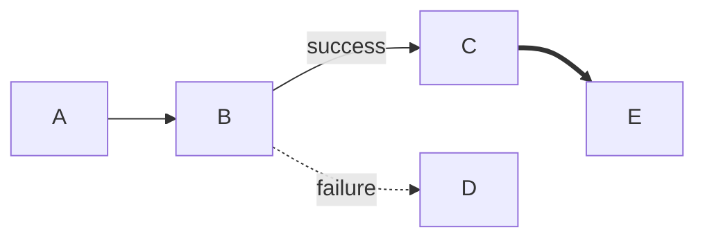

# Mermaid Syntax Rules

Critical syntax rules to prevent parsing errors. Follow these rules strictly.

## Rule 1: Avoid List Syntax Conflicts

The most common error. Mermaid interprets `[1. Text]` as markdown list.

```mermaid
%% WRONG - triggers "Unsupported markdown: list"
[1. Perception]
[2. Processing]
[3. Output]

%% CORRECT - remove space after period
[1.Perception]
[2.Processing]
[3.Output]

%% CORRECT - use circled numbers
[① Perception]
[② Processing]
[③ Output]

%% CORRECT - use parentheses
[(1) Perception]
[(2) Processing]
[(3) Output]

%% CORRECT - use "Step" prefix
[Step 1: Perception]
[Step 2: Processing]
[Step 3: Output]
```

**Circled number reference**: ①②③④⑤⑥⑦⑧⑨⑩⑪⑫⑬⑭⑮⑯⑰⑱⑲⑳

## Rule 2: Subgraph Naming

Subgraphs with spaces in names require specific syntax.

```mermaid
%% WRONG - space in name without quotes
subgraph AI Agent Core
    A --> B
end

%% CORRECT - use ID with display name
subgraph agent["AI Agent Core"]
    A --> B
end

%% CORRECT - use simple ID only (no spaces)
subgraph agent
    A --> B
end

%% CORRECT - nested subgraphs (max 2 levels)
subgraph outer["Outer Layer"]
    subgraph inner["Inner Layer"]
        A --> B
    end
end
```

## Rule 3: Node References

Always reference nodes/subgraphs by their ID, not display name.

```mermaid
%% WRONG - reference display name directly
Title --> AI Agent Core
Process --> User Interface

%% CORRECT - reference subgraph/node ID
Title --> agent
Process --> ui

%% Full example
graph TB
    subgraph agent["AI Agent Core"]
        A[Process]
    end
    subgraph ui["User Interface"]
        B[Display]
    end
    agent --> ui
```

## Rule 4: Special Characters in Node Text

Certain characters need escaping or alternatives.

```mermaid
%% CORRECT - use quotes for text with spaces
A["Text with spaces"]
B["Multiple words here"]

%% CORRECT - escape quotation marks with Chinese quotes
A["He said『Hello』"]
B["The『important』part"]

%% CORRECT - use special brackets for parentheses
A["Function「param」"]
B["Value「x, y」"]

%% CORRECT - line breaks only in circle nodes
A((Line 1<br/>Line 2))
B(("Multi<br/>Line<br/>Text"))

%% WRONG - line breaks in square nodes often fail
A["Line 1<br/>Line 2"]
```

**Character substitutions:**

| Original | Substitute | Notes |
|----------|------------|-------|
| `"` | `『』` | Double quotes |
| `'` | `「」` | Single quotes |
| `(` `)` | `「」` | Parentheses in text |
| `[` `]` | `〔〕` | Brackets in text |
| `<` `>` | `＜＞` | Angle brackets |

## Rule 5: Arrow Types

Use the correct arrow syntax for different relationships.

| Arrow | Syntax | Use Case |
|-------|--------|----------|
| Solid | `-->` | Default, main flow |
| Solid with text | `-->\|label\|` | Labeled transitions |
| Dashed | `-.->` | Optional paths, weak links |
| Dashed with text | `-.->\|label\|` | Optional with label |
| Thick | `==>` | Emphasis, important flow |
| Thick with text | `==>\|label\|` | Important with label |
| Invisible | `~~~` | Layout only, no visible line |



## Rule 6: classDef Styling

Style definitions require proper initialization.

```mermaid
%% WRONG - classDef may not apply
classDef core fill:#e94560
class A core

%% CORRECT - add init directive
%%{init: {'themeVariables': {}}}%%
graph TB
    classDef core fill:#e94560,stroke:#333,color:#fff
    classDef secondary fill:#4a90d9,stroke:#333,color:#fff

    A[Node A]:::core
    B[Node B]:::secondary

    class A,C core
    class B,D secondary
```

## Common Errors Quick Reference

| Error Message | Cause | Fix |
|---------------|-------|-----|
| "Unsupported markdown: list" | `[1. Text]` pattern | Remove space: `[1.Text]` |
| "Unexpected bracket" | Unmatched `[]` or `()` | Check all brackets paired |
| "Invalid arrow" | Wrong arrow syntax | Use `-->`, `-->>`, `-.->` |
| "Class not found" | classDef without init | Add `%%{init: ...}` |
| "Parse error" | Special chars in text | Escape with `『』`, `「」` |
| "Subgraph not found" | Reference by display name | Use subgraph ID |

## Color Semantics

Apply colors consistently based on meaning:

| Color | Hex (light/dark) | Semantic Use |
|-------|------------------|--------------|
| Green | #d3f9d8 / #2f9e44 | Input, start, perception |
| Red | #ffe3e3 / #c92a2a | Planning, decisions, warnings |
| Purple | #e5dbff / #5f3dc4 | Processing, reasoning, logic |
| Orange | #ffe8cc / #d9480f | Actions, tools, execution |
| Cyan | #c5f6fa / #0c8599 | Output, results, endpoints |
| Yellow | #fff4e6 / #e67700 | Storage, memory, data |
| Pink | #f3d9fa / #862e9c | Learning, optimization |
| Blue | #e7f5ff / #1971c2 | Metadata, titles, info |
| Gray | #f8f9fa / #868e96 | Neutral, traditional, disabled |

## Validation Checklist

Before finalizing any diagram:

- [ ] No "number. space" patterns (use `1.Text` or `① Text`)
- [ ] All subgraphs use `id["display name"]` format
- [ ] All references use node/subgraph IDs
- [ ] Special characters properly escaped
- [ ] Arrow syntax is valid
- [ ] classDef has init directive if used
- [ ] Max 2 levels of subgraph nesting
- [ ] Max 6 nodes per subgraph for readability
