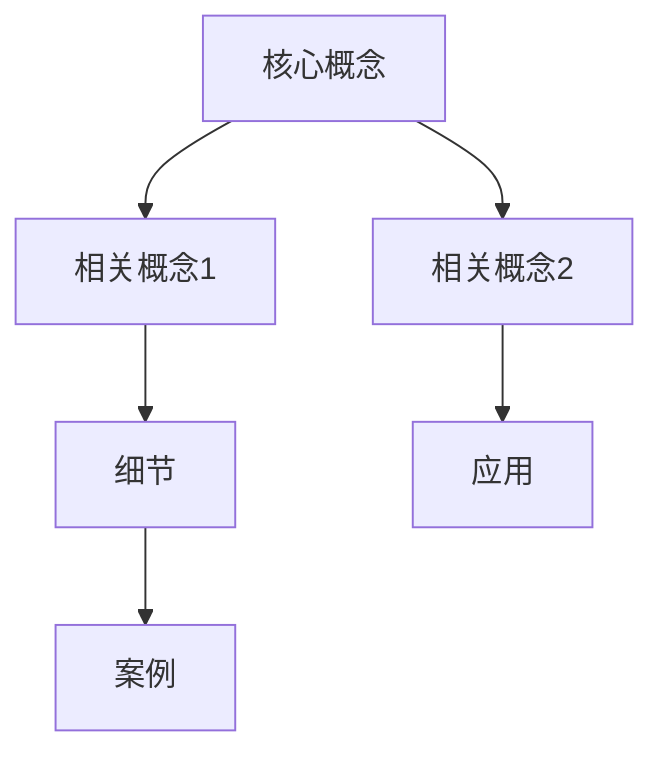

# Knowledge Sync

Sync, aggregate, and visualize your knowledge ecosystem.

## Usage

```bash
# Aggregate scattered notes
/life-knowledge-sync --mode aggregate ./sources/ ./output/

# Generate knowledge graph
/life-knowledge-sync --mode graph ./vault/ -o ./graph.html

# Sync between Obsidian and Logseq
/life-knowledge-sync --mode sync ./obsidian/ ./logseq/

# Find orphaned notes
/life-knowledge-sync --mode orphans ./vault/
```

## What It Does

| Input | Output |
|-------|--------|
| Scattered notes | Aggregated collection |
| Multiple vaults | Unified knowledge base |
| Orphaned notes | Connected graph |
| Raw notes | Knowledge network |

## Core Features

### Note Aggregation
```
Sources: ./inbox/ ./brainstorm/ ./journal/
       ↓
Output: ./knowledge-base/ (unified, deduplicated)
```

### Knowledge Graph
```
Notes with links → Visual graph (Mermaid/HTML)
├── Nodes: Each note
├── Edges: Wiki-links [[...]]
└── Clusters: Topic groups
```

### Link Management
- Find orphaned notes (no incoming links)
- Suggest potential connections
- Fix broken links
- Generate backlink index

## Graph Output Example



## Best For

- Obsidian vault maintenance
- Logseq knowledge management
- Multi-source note aggregation
- Knowledge graph generation
- Link discovery

## Script Directory

**Important**: All scripts are located in the `scripts/` subdirectory of this skill.

**Agent Execution Instructions**:
1. Determine this SKILL.md file's directory path as `SKILL_DIR`
2. Script path = `${SKILL_DIR}/scripts/main.js`
3. Replace all `${SKILL_DIR}` in this document with the actual path

**Script Reference**:
| Script | Purpose |
|--------|---------|
| `scripts/main.js` | Main orchestration |
| `scripts/aggregator.js` | Merge and deduplicate notes |
| `scripts/graph.js` | Generate knowledge graphs |
| `scripts/linker.js` | Link analysis and repair |

## Extension Support

Custom styles and configurations via EXTEND.md.

**Check paths** (priority order):
1. `.life-good-skill/life-knowledge-sync/EXTEND.md` (project)
2. `~/.life-good-skill/life-knowledge-sync/EXTEND.md` (user)

If found, load before Step 1. Extension content overrides defaults.

---

## Prompt Content

When loaded, AI acts as:

**Role**: Knowledge Management Expert

**Context**:
- User has scattered notes across multiple sources
- Goal: Aggregate, sync, and visualize knowledge
- Output: Unified vault with knowledge graph

**Task**:
1. Scan all source directories for markdown files
2. Extract metadata (tags, links, dates)
3. Aggregate and remove duplicates
4. Generate knowledge graph visualization
5. Identify orphaned notes and suggest connections

**Output**:
- Aggregated markdown files
- Knowledge graph (HTML/Mermaid)
- Link analysis report
- Orphaned notes list

**Process**:
1. Collect all markdown files
2. Parse frontmatter and links
3. Build connection map
4. Generate visualizations
5. Write unified output

**Opening**: "请提供需要同步的知识库目录，我将聚合笔记、生成知识图谱并优化链接结构。"

**Script Usage**:
```bash
npx -y bun ${SKILL_DIR}/scripts/main.js --mode aggregate ./sources/ -o ./unified/
npx -y bun ${SKILL_DIR}/scripts/main.js --mode graph ./vault/ -o ./graph.html
```
