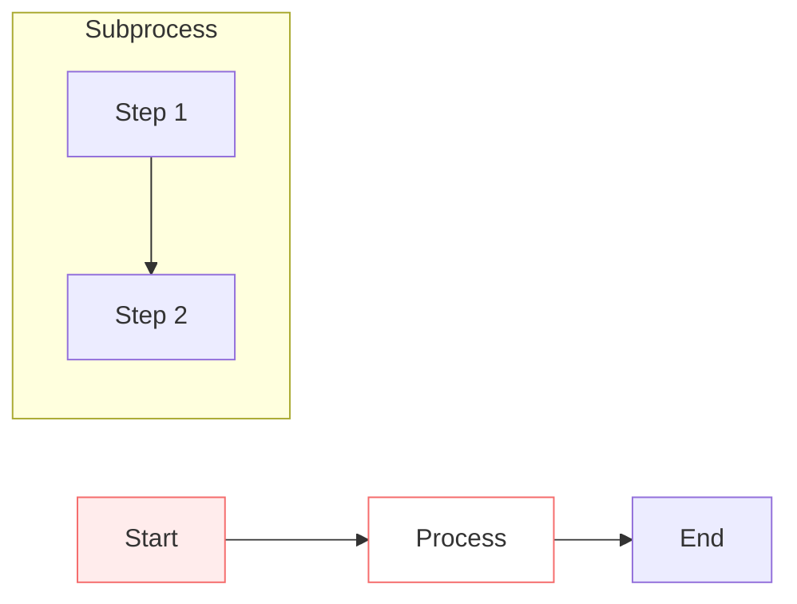

# Mermaid Diagram Master

Create professional Mermaid flowcharts using structured thinking and clear visual design.

## Usage

```bash
# Generate flowchart from description
/life-mermaid-master

# Describe your process or system when prompted
# e.g., "A customer order fulfillment workflow"
```

## Features

- **Structured Analysis**: Uses Minto Pyramid thinking for clear logic
- **Universal Templates**: Works for business processes, decisions, system architecture
- **Clean Layout**: Balanced proportions (1:1, 4:3, 3:4, 5:4, 4:5)
- **Standard Syntax**: Readable and maintainable Mermaid code
- **Professional Styling**: Consistent colors, borders, and connectors

## Best For

- Business process flows
- Decision trees
- System architecture diagrams
- Workflow documentation
- Logic visualization

## Output Format



## Extension Support

Custom styles and configurations via EXTEND.md.

**Check paths** (priority order):
1. `.life-good-skill/life-mermaid-master/EXTEND.md` (project)
2. `~/.life-good-skill/life-mermaid-master/EXTEND.md` (user)

If found, load before Step 1. Extension content overrides defaults.
