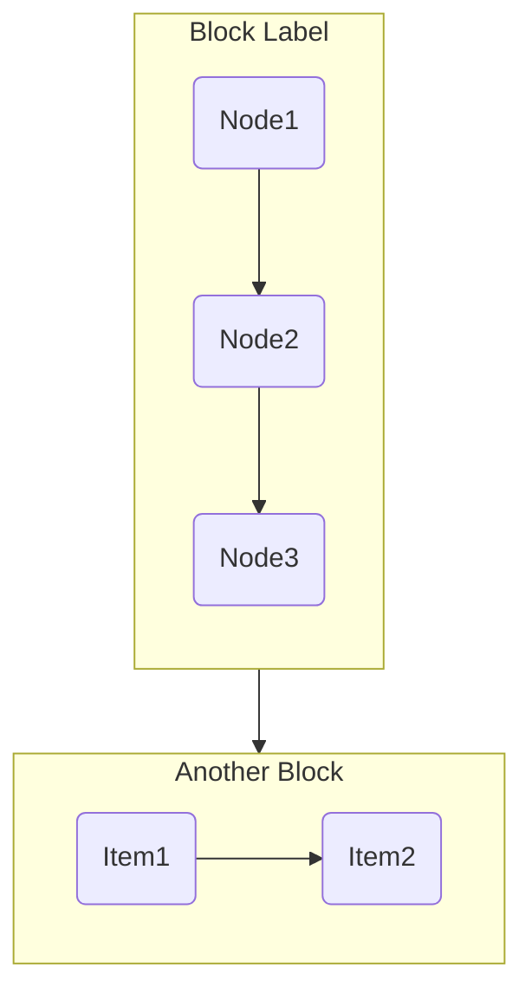

# Layout Optimization Guide

Layout optimization ensures Mermaid diagrams have proper proportions and visual balance.

## Layout Method: 4-Step Process

### Step 1: Determine Subgraph Count

Count the logical blocks in your content. Each block should represent a distinct concept or phase.

```python
# Example: 6 logical blocks
blocks = [
    {"name": "prob", "label": "核心问题", "nodes": [...]},
    {"name": "iden", "label": "身份解剖", "nodes": [...]},
    {"name": "stage", "label": "自我发展", "nodes": [...]},
    {"name": "cyb", "label": "控制论", "nodes": [...]},
    {"name": "plan", "label": "一天方案", "nodes": [...]},
    {"name": "frame", "label": "六组件", "nodes": [...]},
]
```

### Step 2: Calculate Optimal Aspect Ratio

| Subgraphs | Recommended Ratio | Grid Layout |
|-----------|-------------------|-------------|
| 2-4 | 4:3 | 2x2 |
| 5-6 | 4:3 | 2x3 |
| 7-8 | 16:9 | 2x4 or 3x3 | **FIX: was 3:2** |
| 9-12 | 16:9 | 3x4 or 4x3 |
| 12+ | 16:9 | Larger grid |

**Standard Ratios**:
| Ratio | Width | Height | Best For |
|-------|-------|--------|----------|
| 4:3 | 800 | 600 | General flowcharts |
| 16:9 | 960 | 540 | Wide diagrams, sequences |
| 1:1 | 600 | 600 | Pie charts, mindmaps |
| 3:4 | 600 | 800 | Tall hierarchies |
| 3:2 | 750 | 500 | Gantt charts |
| 2:3 | 500 | 750 | User journeys |

### Step 3: Choose Flow Direction

| Content | Direction | Reason |
|---------|-----------|--------|
| 6+ subgraphs, 20+ nodes | TB (Top-Bottom) | Vertical flow for complex content |
| 4-6 subgraphs, 15-20 nodes | TB | Default choice |
| 4-6 subgraphs, <15 nodes | LR (Left-Right) | Horizontal for simple content |

**Direction Options**:
- `TB` - Top to Bottom
- `BT` - Bottom to Top
- `LR` - Left to Right
- `RL` - Right to Left

### Step 4: Balance Subgraphs

If any subgraph has more than 6 nodes, split it:

```python
# Before: 9 nodes in one block
# After: Split into 2 blocks (5 + 4)
```

## Subgraph Syntax



## Best Practices

### DO
- Keep each subgraph to 3-6 nodes
- Use short, clear node labels (under 10 characters)
- Connect subgraphs in logical sequence
- Use consistent direction within subgraphs

### DON'T
- Put more than 6 nodes in a single subgraph
- Use `<br/>` in node labels (causes rendering issues)
- Over-nest subgraphs (max 1-2 levels)
- Mix directions (TB inside LR inside TB)

## Example: 6-Block Layout

```python
content_blocks = [
    {"name": "prob", "label": "核心问题", "nodes": ["新年决心失败率 80-90%", "只改行动 不改身份"]},
    {"name": "iden", "label": "身份解剖", "nodes": ["设定目标", "透镜感知", "筛选信息", "采取行动", "获得反馈"]},
    {"name": "stage", "label": "自我发展", "nodes": ["冲动", "保护", "从众", "觉察", "尽责", "个体"]},
    {"name": "cyb", "label": "控制论", "nodes": ["目标", "行动", "感知", "比较", "反馈"]},
    {"name": "plan", "label": "一天方案", "nodes": ["早上", "全天", "晚上"]},
    {"name": "frame", "label": "六组件", "nodes": ["反愿景", "愿景", "年目标", "月项目", "每日", "约束"]},
]

# Auto-generates 4:3 ratio, TB direction
mermaid_code, config = create_subgraph_layout(content_blocks)
```

## Quick Reference

| Parameter | Default | When to Change |
|-----------|---------|----------------|
| aspect_ratio | auto | Specific display requirement |
| flow_direction | auto | Complex vs simple content |
| max_nodes_per_block | 6 | Very simple (3) or complex (8) |
| rank_spacing | 30 | TB direction |
| node_spacing | 20 | TB direction |
| min_width | 800 | Complex diagrams (7+ subgraphs) |

---

## Anti-Patterns & Fixes

### Problem 1: classDef Not Working

**Symptom**: Custom styles don't apply, diagram renders plain.

**Cause**: `classDef` directives need `%%` comment prefix.

```mermaid
%% WRONG - will not work
classDef core fill:#e94560
class A core

%% CORRECT - with %% prefix
%%{init: {'themeVariables': {}}}%%
classDef core fill:#e94560,stroke:#333,color:#fff
class A,B,C core
```

### Problem 2: Diagram Too Small

**Symptom**: Complex diagram appears tiny or cropped.

**Cause**: Missing `min-width` CSS and insufficient `rankSpacing`/`nodeSpacing`.

**Fix**:
```css
.mermaid-container {
    min-width: 950px;  /* For 7+ subgraphs */
    overflow-x: auto;
}
```

```javascript
mermaid.initialize({
    flowchart: {
        rankSpacing: 45,   // Increase from default 30
        nodeSpacing: 35,   // Increase from default 20
    }
});
```

### Problem 3: Wrong Aspect Ratio

**Symptom**: Diagram looks stretched or cramped.

**Cause**: Using 4:3 for 7-8 subgraphs.

**Fix**: Use 16:9 for 7+ subgraphs.

| Subgraphs | Ratio | Width | Height |
|-----------|-------|-------|--------|
| 6 | 4:3 | 800 | 600 |
| 8 | 16:9 | 960 | 540 |

### Problem 4: Nested Subgraph Issues

**Symptom**: Layout breaks, overlapping nodes.

**Cause**: Over-nesting subgraphs (3+ levels).

**Fix**: Flatten structure, max 1-2 levels of nesting.

```mermaid
%% WRONG - 3 levels of nesting
subgraph A
    subgraph B
        subgraph C
            N1 --> N2
        end
    end
end

%% CORRECT - max 2 levels
subgraph A
    direction LR
    N1 --> N2 --> N3
end
```

### Problem 5: Unmatched Brackets False Positive

**Symptom**: Validator flags `[text]` as unmatched brackets.

**Cause**: Mermaid uses `[]` for node labels, not arrays.

**Fix**: The validator should skip `[` in node definitions like `A[Node Label]`.

### Problem 6: Mindmap Styling Not Working

**Symptom**: `:: style` syntax doesn't apply colors.

**Cause**: Mindmap diagram doesn't support `::` styling syntax.

**Fix**: Remove style markers, use simple text labels.

```mermaid
%% WRONG
root((中心))
  节点1 :: pink

%% CORRECT - simple labels only
mindmap
  root((中心))
    节点1[红色节点]
```
